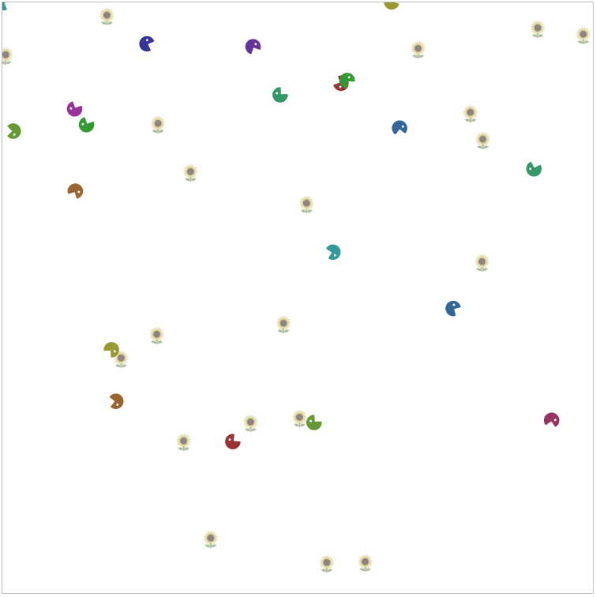

# Genetic programming playground

This is a simple demonstration of Genetic Programming, one of the earliest machine learning algorithms. Visit https://gp.seatiger.org to play 😀

 

## How does it work?

### The goal

The goal is to evolve a population of creatures that eat as much as possible. 

### The environment

The creatures exist on a 2 dimensional board. By default, there are 20 creatures and 20 plants. Each creature has a Lisp-like expression that controls its behaviour. These expressions are randomly generated, and each "tick" the expression is evaluated to determine what action (if any) the creature should take. Creatures are scored based on how much they eat - eating plant gives 1 point and eating another creature gives 5. At the end of each generation, the scores are used to determine which creatures get to survive and which get to reproduce. 

### Death

Creatures and plants die when eaten and are reborn 5 ticks later in a random position on the board. A creature cannot perform any actions while it's dead.  

### Expressions

Each creature has a Lisp-like expression that controls their behaviour, such as `if(canEat(), eat(), move(div(closestFoodDistance(), 2)))`. This particular expression tells the creature to eat if there is food in range, otherwise move forwards half the distance to the nearest edible thing. 

Expressions can be represented as a tree of nodes. There are two types of nodes - terminal nodes and operator nodes. Terminal nodes are simple, they represent a static number, for example `2` in the expression above. Operator nodes act as functions, accepting zero or more parameters and returning a number, for example `canEat()` returns `0` or `1`.

The reason a Lisp-like grammar is used is that we can guarantee that any expression we generate or modify will be syntactically valid. We only need to ensure that each operator receives the correct number of parameters. 

#### Operators

The following operators are supported:

* Arithmetic:
  * **add(a, b)**: Returns a + b
  * **sub(a, b)**: Returns a - b
  * **mult(a, b)**: Returns a * b
  * **div(a, b)**: Returns a / b
* Logic:
  * **eq(a, b)**: Returns 1 if a == b, otherwise 0
  * **neq(a, b)**: Returns 1 if a != b, otherwise 0
  * **gt(a, b)**: Returns 1 if a > b, otherwise 0
  * **lt(a, b)**: Returns 1 if a < b, otherwise 0
  * **gte(a, b)**: Returns 1 if a >= b, otherwise 0
  * **lte(a, b)**: Returns 1 if a <= b, otherwise 0
  * **and(a, b)**: Returns 1 if a && b, otherwise 0
  * **or(a, b)**: Returns 1 if a || b, otherwise 0
  * **not(a)**: Returns 1 if a is 0, otherwise 1
  * **if(a, b, c)**: Returns b if a is non-zero, otherwise c
* Perception:
  * **closestPlantDistance()**: Returns the distance to the the plant that's closest to the creature
  * **closestPlantAngle()**: Returns the angle (relative to the creature's current heading) of the plant that's closest to the creature
  * **closestCreatureDistance()**: Returns the distance to the the creature that's closest to the creature
  * **closestCreatureAngle()**: Returns the angle (relative to the creature's current heading) of the creature that's closest to the creature
  * **closestFoodDistance()**: Returns the distance to the food (creature or plant) that's closest to the creature
  * **closestFoodAngle()**: Returns the angle (relative to the creature's current heading) of the food (creature or plant) that's closest to the creature
  * **canEat()**: Returns 1 if there is something close enough to the creature's mouth to eat, otherwise 0
* Actions
  * **eat()**: Attempts to eat (regardless of whether there's anything there or not). Only things within 1 unit of the creature's position and 45 degrees of its heading can be eaten. 
  * **move(a)**: Moves the creature `a` units in the direction of the creature's heading. `a` may be between -2 and +2 - calling `move(5)` is equivalent to `move(2)`. Creatures can step on other creatures and plants, but cannot move outside the boundaries of the board. 
  * **turn(a)**: Turns the creature `a` radians from its current heading. `a` may be between -PI/4 and +PI/4 - calling `turn(PI/2)` is equivalent to calling `turn(PI/4)`.

The value returned by the root node is ignored, since we only care about what action the creature wants to perform. 

#### Generating expressions

To generate an expression, we create the root node, which recursively creates all the subnodes.  

To generate a node, we:
1. Randomly choose whether to create an operator or a terminal node. 
2. If it's a terminal node, we randomly choose a value between -5 and 5. 
3. If it's an operator node, we:
   1. Randomly choose the operator
   2. Look up how many parameters that operator requires
   3. For each parameter, we generate a child node by starting from step 1.  

To avoid creating extremely deep trees, the probability of choosing a terminal or operator node changes with depth. At the root node, the chance of deciding to create an operator node is extremely high. As we get deeper, the probability of generating a terminal node increases, reaching 1 at the maximum tree depth (currently 20).   

### Performing actions

Creatures are able to perform a single action per tick, and the first attempted action wins. This can result in some surprising situations, for example the expression `move(and(3, eat()))`, will cause the creature to _eat_, not move since `eat()` is evaluated first (in order to determine the value of the argument to `move()`). On the other hand, due to short-circuit evaluation, `move(or(3, eat()))` will result in the creature moving instead, since `3 || anything` is true, and thus `eat()` is not evaluated.

In order to provide a fair environment, we:

1. Determine the desired action for each creature
2. Randomise the order of these actions so that we don't favour creatures towards the start of the creatures array
3. Attempt to perform each action 

Since the environment may have been changed by a previous action, some actions may be unsuccessful. For example a creature may fail to eat if the food it was attempting to eat (or indeed the creature itself) has already been eaten by something else. 

### Evolution

Initially the expressions are randomly generated. We then attempt to improve the performance (fitness) of the population by iteratively evolving them. This process works as follows:

1. For each generation:
   1. Perform several "runs". For each run:
      1. Randomise the locations and headings of creatures and plants
      2. Run the board for the specified number of ticks. For each tick:
         1. Determine the desired action of each creature
         2. Randomise the order of the actions to ensure fairness
         3. Attempt to perform each action in turn
      3. Record the total score for this run
   2. Order the creatures total score across all of the generation's runs
   3. The expressions of the best creatures (as determined by the survival rate) get copied to the next generation unchanged
   4. While the number of creatures in the new generation is less than the desired number:
      1. Randomly choose a creature to breed from, using log(creature's total score) to weight its probability
      2. When copying the creature's expression to the new generation, randomly regenerate some of the branches in its tree

Over many generations, by choosing the creatures that eat the most and randomly modifying some of them, we are able to keep the beneficial changes and discard the harmful ones. Since creatures that eat more have a higher chance of reproducing, beneficial changes slowly spread across the population. 

## Usual progression

With the default settings, the simulation generally progresses through four distinct phases:

1. No eating: Since the initial expressions are completely random, creatures don't know that they need to eat. Some may turn or move but the score will be zero. 
2. Continuous eating: Creatures discover that calling `eat()` is the key to reproductive success. The entire population does nothing but attempt to eat. The creatures that happen to get placed near a plant or other creature get lucky, others don't. With the default settings, scores in this phase range from 1 to around 40, depending on random placement.  
3. Eating when there's food: Creatures discover the formula `if canEat() then eat() else do something else`. That something else may be either turning or moving. This phase generally lasts only a few generations and marked by a very rapid increase in score, from 80+ to around 300.  
4. Eating with optimised movement: Creatures discover they can eat the most if they move approximately one unit each turn (if there isn't food). This movement may be forwards or backwards, or sometimes both depending on what's near them. Scores average 400 during this phase.
5. Eating while running backwards: Over time, creatures learn it's better to run backwards than forwards. Since creatures cannot perceive the walls, they get stuck on them and eventually travel to the corners. By moving backwards, they are facing outwards from the corner and thus have a chance to eat the other creatures that collect there. Creatures that run into the walls forwards are facing inwards and thus cannot eat. Scores are generally around 500 in this phase. 

Generally the simulation should reach phase 5 by around generation 500. If it hasn't feel free to reset it and try again. 

I have not yet seen any progression beyond stage 5. Due to the mechanics of getting stuck in corners it's likely that stage 5 represents the close-to-optimal strategy in this environment. It would be interesting to see making creatures able to perceive walls and corners changes this behaviour. 

